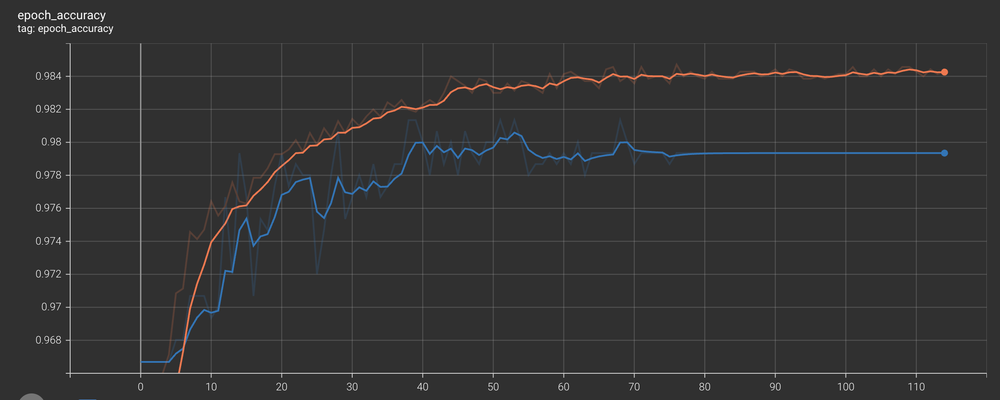

# **Machine Maintenance Predictor**

---

## 📚 Overview
This project aims to predict machine failures based on various sensor and operational data. The dataset used is from the "Machine Predictive Maintenance Classification" dataset available on [Kaggle](https://www.kaggle.com/datasets/shivamb/machine-predictive-maintenance-classification).

---

### **Problem**
We aim to predict whether a machine will fail based on features like air temperature, rotational speed, torque, and tool wear. The target variable is `Failure`, which indicates if a machine failed during operation.

---

## 📂 Data Description
- **UID**: unique identifier ranging from 1 to 10000
- **ProductID**: consisting of a letter L, M, or H for low (50% of all products), medium (30%), and high (20%) as product quality variants and a variant-specific serial number
- **air temperature [K]**: generated using a random walk process later normalized to a standard deviation of 2 K around 300 K
- **process temperature [K]**: generated using a random walk process normalized to a standard deviation of 1 K, added to the air temperature plus 10 K.
- **rotational speed [rpm]**: calculated from powepower of 2860 W, overlaid with a normally distributed noise
- **torque [Nm]**: torque values are normally distributed around 40 Nm with an σ = 10 Nm and no negative values.
- **tool wear [min]**: The quality variants H/M/L add 5/3/2 minutes of tool wear to the used tool in the process. and a
'machine failure' label that indicates, whether the machine has failed in this particular data point for any of the following failure modes are true.
- **Target**: Failure or Not
- **Failure Type**: Type of Failure

---

## 🔧 Data Preprocessing
### Converting Units
Converted air and process temperature from Kelvin to Celsius, and tool wear time from minutes to seconds for easier interpretation.

### Data Wrangling
Dropped irrelevant features (UID and ProductID) and handled missing data using imputation methods. Also, transformed `Failure Type` into a categorical format using encoding techniques.

### Train, Validation, and Test Sets
Created unique identifiers and used hashing for splitting data into train, validation, and test sets. This ensures consistent splits across runs.

---

## 📊 Data Exploration
### Visualizations
We used Seaborn to plot histograms, boxplots, and scatter plots to analyze feature distributions, class imbalances, and relationships between `Torque`, `Rotational Speed`, and `Failure Type`.

### Key Insights
- `Torque` and `Rotational Speed` show clear relationships with failure type.
- The `Failure Type` column is more informative than the `Target` column, so `Target` was dropped from the dataset.

---

## 🔄 Model Building
### Model Architecture:
Built an **Artificial Neural Network (ANN)** with a **Wide and Deep Architecture** using Keras. This architecture uses a combination of deep layers for feature abstraction and wide layers for learning feature interactions.

### Callbacks Setup:
- **CheckPoint**: Saved the best model based on validation loss.
- **EarlyStopping**: Stopped training early if validation loss didn't improve after 7 epochs.
- **TensorBoard**: Enabled logging for training visualization.
- **ReduceLROnPlateau**: Reduced learning rate if the validation loss plateaued.

---

## 🛠️ Model Enhancements
### Batch Normalization and Regularization:
To prevent overfitting and improve convergence, we added **Batch Normalization** and **$\ell_1$/$\ell_2$ Regularization** to stabilize training and promote feature selection.

### Hyperparameter Tuning:
Used **RandomizedSearchCV** and **SciKeras** to fine-tune model hyperparameters, such as the number of hidden layers, neurons, regularization strengths, and learning rate.

### Final Model Performance
After hyperparameter optimization, we achieved a model with a **98.6% accuracy**.

---

## 📉 TensorBoard Training Visualization
To better understand the training process and monitor model performance in real time, we used TensorBoard. Below are key screenshots that highlight training and validation progress:

### 🟦 Loss Over Epochs
#### Base Wide And Deep Model
<p align="center">
  
</p>

#### Improved Wide And Deep Model
<p align="center">
  
</p>

#### Final Wide And Deep Model
<p align="center">
  
</p>

### 🟩 Accuracy Over Epochs
#### Base Wide And Deep Model
<p align="center">
  
</p>

#### Improved Wide And Deep Model
<p align="center">
  
</p>

#### Final Wide And Deep Model
<p align="center">
  
</p>

*Smoothing parameter in TensorBoard was set to 0.65 to clearly show the trend without losing important learning dynamics.*

---

## 🚀 Key Takeaways
- **Feature Importance**: `Rotational Speed` and `Torque` are the most predictive features for machine failure.
- **Model Performance**: The final model achieved a high accuracy of 98.7%.
- **Model Efficiency**: The Wide and Deep architecture improved model performance by capturing both high-level feature interactions and direct feature contributions.

---

## 💾 Final Notes
This project provides a robust pipeline for predicting machine failures, offering practical insights into both feature importance and model performance tuning.

---

## 🛠️ Libraries Used
```python
import os 
import kaggle
import pandas as pd 
import numpy as np
%matplotlib inline
import matplotlib.pyplot as plt
import seaborn as sns
import statistics
from zlib import crc32
from sklearn.impute import SimpleImputer 
from sklearn.preprocessing import OneHotEncoder
from sklearn.pipeline import Pipeline
from sklearn.preprocessing import StandardScaler
from sklearn.compose import ColumnTransformer
import time
import tensorflow as tf
from tensorflow import keras
from scikeras.wrappers import KerasRegressor
from keras import regularizers
from keras import activations
from keras.layers import BatchNormalization, LeakyReLU
from keras.callbacks import ReduceLROnPlateau
from sklearn.model_selection import RandomizedSearchCV
